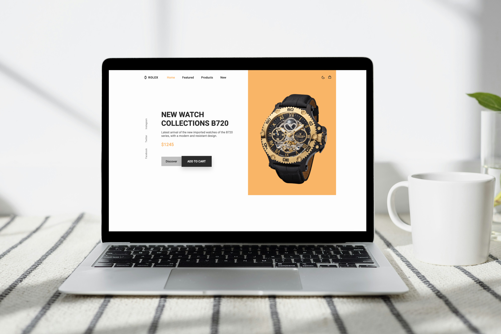

## ⌚ Watch Website - Luxury Landing Page

An elegant and modern landing page for a premium watch brand. This project combines minimalist design with high functionality, ensuring an excellent user experience (UX).

## ✨ Features

- Premium UI Design: An aesthetic visual layout that emphasizes the luxury status of the products.
- Color Selection Section: Interactive model viewing (allowing users to explore different style variations).
- Fully Responsive: The website is perfectly optimized for mobile devices, tablets, and desktops.
- Smooth Scroll: Seamless navigation between different sections of the site for a fluid feel.
- Custom Icons: Integration of modern icon sets to display product specifications clearly.

## 🛠️ Tech Stack

- HTML5 & CSS3: Clean semantic markup and advanced styling techniques for a polished look.
- JavaScript: Powering interactive elements, mobile menu management, and animations.
- Google Fonts: High-quality typography selected to maintain a premium brand image.
- Boxicons / Remix Icons: Modern icon libraries used for crisp interface details.
